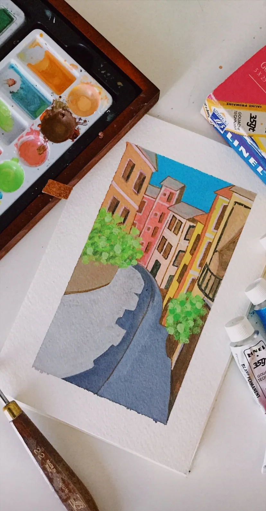

# Why Paint with Gouache?

Whenever I mention my painting hoby to my friends, [re: see my art!](../art) gouache paint is always hard to explain. We’re all too familiar with the acrylic, watercolour or oil. While all three of the former have their perks, there was always something missing. Over the past 3 years, gouache (pronounced goo-aash) has always stuck with me.

One of my paintings of street in Spain

Until I started using gouache, I much preferred oil because of its wide range of colours and its ability to blend well. However, it’s expensive and takes rather long to dry. Not to mention, its potent smell was unbearable when it engulfed my living room on those humid summer days. Watercolour, while cheaper, never fit with my style; shear, unpredictable and imprecise, mistakes are unbelievably hard to correct. I usually ended up flooding the entire page and had to start over. Acrylic is a favourite by many, but its plastic finish was not something I fancied.

Nothing seemed to click, until one day when I stumbled upon an old gouache set collecting dust in my cupboard. I naturally Googled the paint medium for opinions before I got my hands dirty. The consensus? Very mixed. Out of 1–10, the artist community rates gouache in the two extremes; they either love it or hate it. I wanted to test these supposed claims for myself.

My first gouache painting is shown above. I used the Lefranc & Bourgeois Linel Artist’s Gouache and painted on watercolour paper. I have to admit, the medium is alarmingly different from the rest. It is almost exactly similar to how it is called — very “gouache-y.” In that I mean it is almost has a gooey consistency, but not in a sticky way, more like Kinetic Sand.

I would describe the texture and appearance of gouache paint as matte lipstick — familiar, but feels trendy and different.

So, why would anyone want to paint with matte lipstick Kinetic Sand paint? Many reasons:

### 1. The Matte Finish 
Gouache provides an opaque and deep colour that is easily applied and turns out uniform. Bonus: that helps with taking accurate pictures since it eliminates glare.

### 2. Easy Cleanup
If you want the opaqueness that oil provides you, but despise the tedious amount of hard-to-remove residue that it comes with, gouache is for you. It wipes off like watercolour!

### 3. Reusable Colours
With gouache, I love that I can reuse my pre-mixed paints without fear of having to remake my sky colour for 2 hours; the gouache colours dry on your palette tray. Just add water!

### 4. Instant Dry
Gouache dries as fast as watercolour (Who like to watch paint dry?). I can frame a small painting in a day or two. Great for a quick scenery paint while travelling.

### 5. One-Stop-Shop
Gouache can wash (that rhymes) like watercolour, blend like oil paints, and can be dry brushed like acrylic.

And many more!

## Gouache Setbacks
Unfortunately, nothing is perfect. Here are some inconsistencies I found while painting with gouache:

You will run out of white fast — beware. Buy two tubes if possible.
Gouache paint dries darker. (Why you need more of the white to get those brighter tones).
All you have to do now is take my word and get some water, a paintbrush and some gouache, the matte lipstick Kinetic Sand paint everyone should try.

