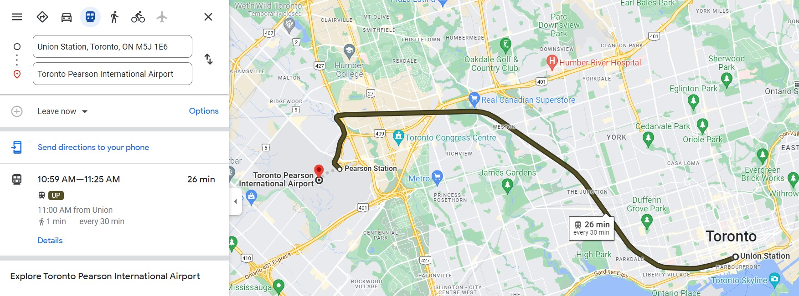
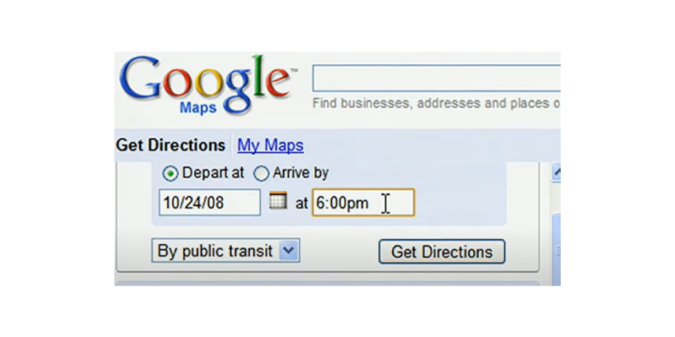
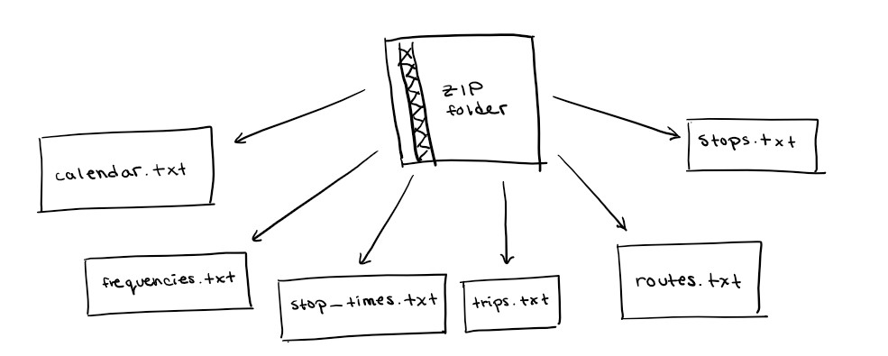
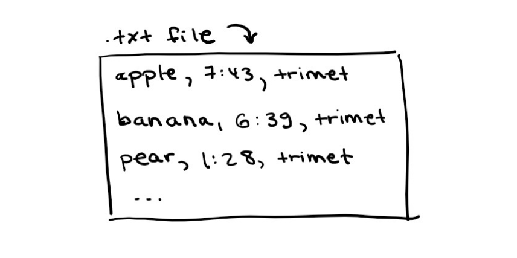

# An Intro to GTFS

You just arrived to a new city, got your bus pass and you're trying to get to that restaurant your friend recommended you. How do you get there? For many, a trip planning process like this involves trip planners or online map platforms like Google Maps.

As an example, let's find transit route options from Toronto's Union Station to Toronto Pearson Airport on Google Maps. You'll quickly find that it recommends a train route directly to the airport including it's departure time, departure frequency, transit agency and mode of transport:

Google Maps in 2022. **Credits**: My screenshot (also Google)

Have you ever wondered how Google does this? You're in the right place! First, let's time travel back to the humble beginnings of Google Transit.

Back in 2002, trip planning information was only available for cars. If you wanted to plan your 2002 high school grad road trip, you were in luck. Figuring out bus directions, however, was not as easy if you weren't a local.

Some Google software engineers, namely [Chris Harrelson](https://twitter.com/chrishtr?lang=en), noticed this gap in Google Maps' trip planner. They used their [20% time](https://www.cnbc.com/2021/12/16/google-20-percent-rule-shows-exactly-how-much-time-you-should-spend-learning-new-skills.html#:~:text=Enter%3A%20Google's%20%E2%80%9C20%25%20time,wrote%20in%20their%20IPO%20letter.) to make [Google Transit](https://developers.google.com/transit), a platform that could provide transit directions with the efficiency and accuracy car trip planners had at the time.

Their only problem was getting data. Companies like Google are known for knowing *everything about you*. They pretty much have almost all the internet data, ever. By this logic, they can definitely scrape all the transit data out there, right?? It was not as easy as it seemed. Transit routes were not updated in real-time and not all transit agencies were willing to provide open data to Google let alone have any accurate transit data available, *especially* small transit agencies. Instead, outdated data was mailed via CD. **BY CD!** This was not only inefficient, but super archaic. 

This is where Portland, Oregon comes in. Yeah I know, super random, but Portland was actually super integral to everything related to transit data. In fact, an IT manager, [Bibiana McHugh](https://www.linkedin.com/in/bibiana-mchugh-3a073811/) within Portland's transit agency, [Trimet](https://trimet.org/home/), was the first to reach out to Google and provide them with transit data in a ZIP file to kickstart GTFS in 2005. Shortly after, there was actually a transit option on Google Maps!! (Watch this video to see a ✨ vintage ✨ [demo of Google Maps in 2009](https://www.youtube.com/watch?v=pN0MljOP1Gg&curius=1461&ab_channel=Google)). Is 2009 considered vintage? Tech moves too fast anyways so I'll let that slide. 

Google Transit in 2009. **Credits**: Google

Now we can officially get into what GTFS is! It stands for "Google Transit Feed Specification" (or used to). It's a standardized way to organize transit data. It consists of information like stops, schedules, and route names in a ZIP file containing lots of [CSV files](https://en.wikipedia.org/wiki/Comma-separated_values) (Excel sheets are CSV files!) in the form of text files.

Here's how it's broken down:

Each text file (with a .txt extension) has it's own information, say stop times and agency name, separated by commas:

Sure, TXT files aren't super sophisticated. But that's the point: it's *simple*. **Any** transit agency, big or small can simply export a bunch of CSV files from Excel with specific names like routes.txt into a folder, zip it, and send it to Google Transit. Agencies like Trimet also automate this process!

Soon enough, [many more transit agencies](http://www.gtfs-data-exchange.com/agencies) hopped on board. Most of them are large, established and based in North America. To reflect this growth, the "Google" in Google Transit Data Specification was changed to "General" because the data was slowly being used by many [third-party apps and transit planners around the world](https://gtfs.org/resources/apps/). Tech giants like Google continue to have a lot of stigma surrounding privacy and data, so renaming GTFS to something more neutral allows it to be more approachable and flexible for all uses. 

This is why I'm such an advocate for GTFS. Here's why: 
- It's open-source; any individual developer, company, startup or agency can use the data provided by transit agencies.
- It can be used for almost anything (not only transit planners)! Think: planning accessibility tools or timetable creation.
- Transit is now placed on the same pedestal as cars. It's now easier to find transit directions. All you need is an internet connection.
- Smaller transit agencies have more publicity and more ridership from newcomers of foreigners.
- Frequent riders now have real time updates of transit delays using [GTFS realtime](https://developers.google.com/transit/gtfs-realtime).
- For the average transit IT worker, it's not overly hard to use. Impactful things don't have to be complex.

As with anything, there are inconsistencies with GTFS. Some small transit agencies still don't have the technical expertise and/or trust in other third-parties to use their transit data. How can we make GTFS *even easier* to use? Companies like [Arcadis IBI Group](https://www.ibigroup.com/ibi-products/transit-data-tools/) are making GTFS data more accessible for small transit agencies by making open-sourced platforms that display the data in an easy format! I'm still in the process of discovering what new GTFS innovations are out there, but one thing I've noticed along the way is that we need more builders/hackers in the transit industry. Will you be one?

I personally hope to be; I'm excited for what I can contribute to GTFS this year and where that will lead. In turn, I hope you're inspired to get started too. [Reach out](mailto:adriana.ceric@gmail.com) if you are or if I can improve this article in any way. 

If you read this far, I urge you to switch tabs from cars to transit next time you're searching for directions. After all, a transit agency near you worked hard to make that possible.

Hope you get to point B,

Adriana
