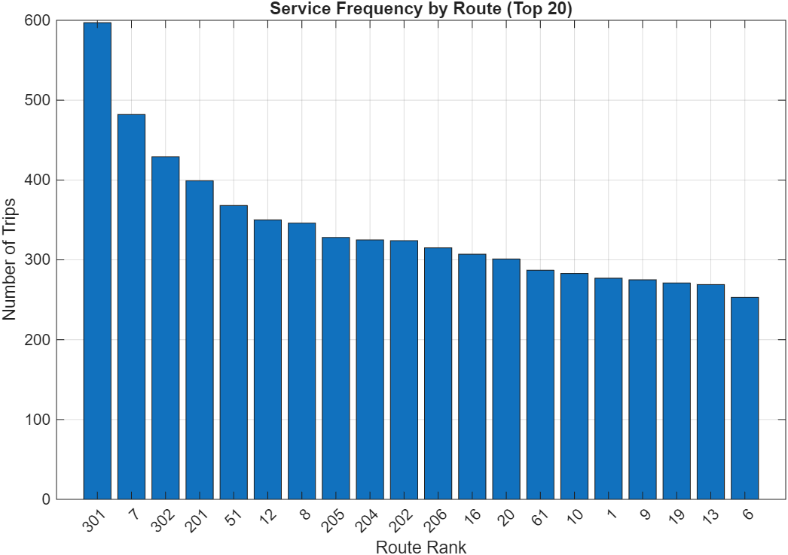
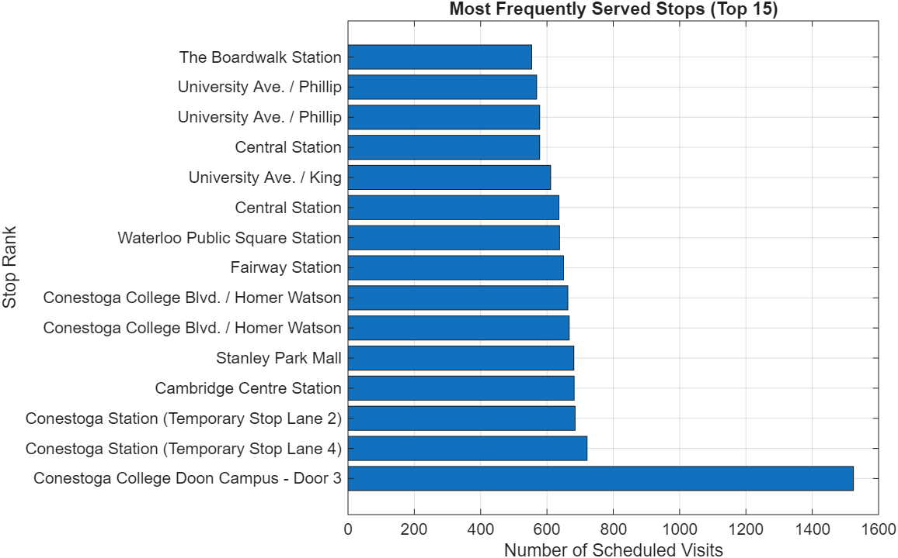
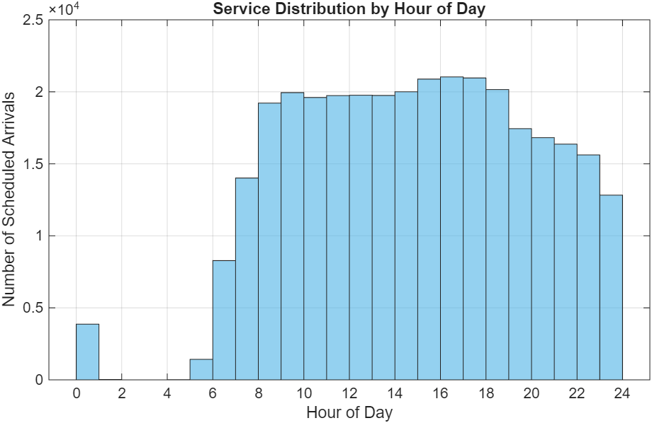

# GRT Route Stats

I was curious about three things about Grand River Transit's transit data: which stops get the most service, how trip frequency varies by route, and when buses actually run throughout the day.

If you want to learn more about GTFS, read my [GTFS blog](gtfs-101)!

## Some Stats!

The GRT dataset loaded with:
- 2,343 stops
- 53 routes  
- 11,319 trips
- 327,744 scheduled stop times

## Three Questions, Three Charts

### 1. Service Frequency by Route
First, I wanted to see which routes have the most trips. This required counting trips per route and sorting them:

```matlab
route_trip_counts = groupcounts(trips, 'route_id');
route_trip_counts = join(route_trip_counts, routes(:, {'route_id', 'route_short_name'}), 'Keys', 'route_id');
route_trip_counts = sortrows(route_trip_counts, 'GroupCount', 'descend');
```

The bar chart showed a clear hierarchy - some routes run much more frequently than others, which makes sense for a system serving different ridership levels across the region.



### 2. Most Frequently Served Stops  
Next, I counted how many times each stop appears in the schedule:

```matlab
stop_usage = groupcounts(stop_times, 'stop_id');
stop_usage = join(stop_usage, stops(:, {'stop_id', 'stop_name'}), 'Keys', 'stop_id');
stop_usage = sortrows(stop_usage, 'GroupCount', 'descend');
```

This revealed which stops are the real workhorses of the system - the ones that buses visit most often throughout the day.


### 3. Service Distribution by Hour
For the time analysis, I had to handle MATLAB's automatic conversion of the arrival_time column to duration format:

```matlab
if isduration(stop_times.arrival_time)
    arrival_seconds = seconds(stop_times.arrival_time);
    hours = floor(arrival_seconds / 3600);
end
hours = mod(hours, 24); % Handle times after midnight
```

The histogram showed the expected peaks during morning and evening rush hours, plus the service gaps during overnight hours.


## A Few Practical Notes

**File handling**: The `readtable` function with `'TextType', 'string'` worked well for handling the mixed data types in GTFS files.

**Data joins**: MATLAB's `join` function made it straightforward to combine the route and stop information with the frequency counts.

**Time parsing**: GTFS time data can be tricky since it allows for times like "25:30:00" (meaning 1:30 AM the next day). MATLAB handles this reasonably well when reading the files.

**Route shapes**: The dataset included detailed route shapes (44,286 coordinate points), which I used to create a map showing just the inbound routes to avoid visual clutter.

## Results

The analysis confirmed some intuitive things - major routes have more frequent service, central stops see more buses, and service peaks during rush hours. But it also revealed some specific patterns in how GRT structures its network that weren't immediately obvious from just looking at a route map.

If you're interested in trying this with your local transit data, let me know!