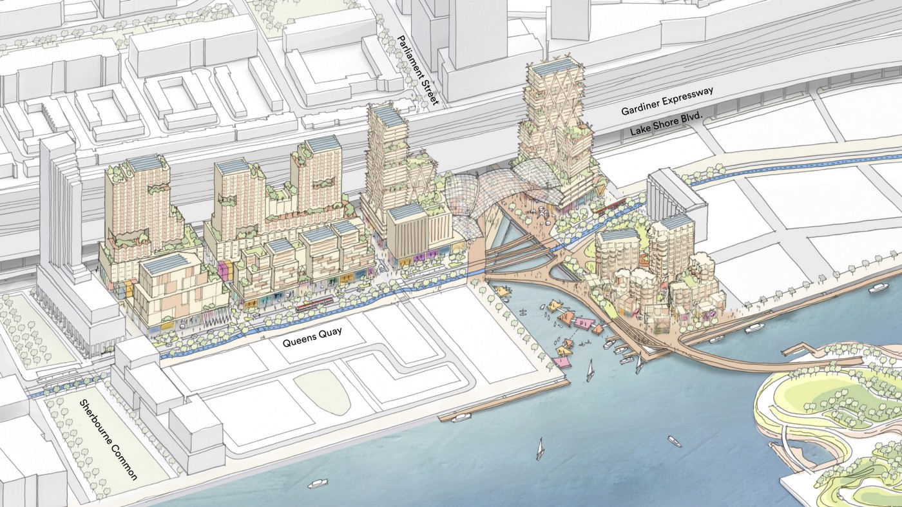
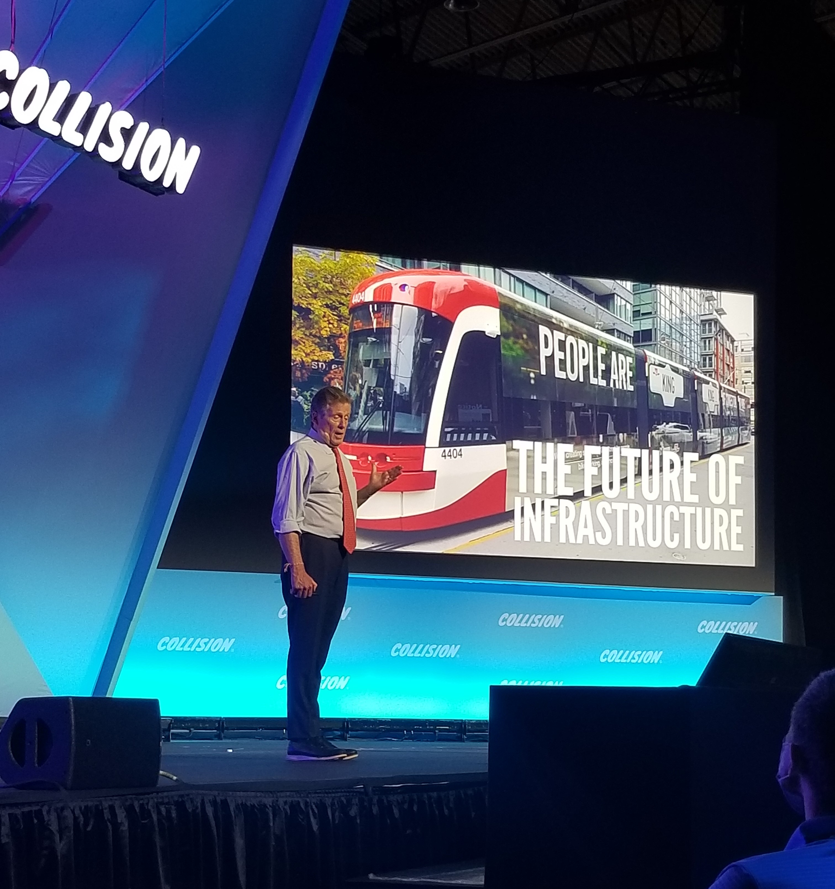

# A New Smart Future for Cities

What does the future of cities look like?

This was a question [Sidewalk Labs](https://www.sidewalklabs.com/), a subsidiary company now merged into Google, attempted to build tangible answers to. In October 2017, Sidewalk’s announcement that it would redevelop Quayside in downtown Toronto took the world by storm. It wasn’t just a new conglomeration of tall apartment buildings and parks (like most of the other developments in Toronto), it was _the future_. It boasted mass timber buildings, affordable housing, and emerging tech like robo-taxis and heated sidewalks.

A 2018 rendering of the Quayside development. Credits: Sidewalk Labs

I first heard about Sidewalk Labs in 2019. Their website was laden with mesmerizing graphics, a diverse, unique team and interesting projects, one being the [“Master Innovation and Development Plan”](https://quaysideto.ca/wp-content/uploads/2019/11/Sidewalk-Labs-Digital-Innovation-Appendix.pdf) or MIDP. I listened to new urban ideas like generative design on their podcast, [City of the Future](https://podcasts.apple.com/ca/podcast/city-of-the-future/id1353905337), on my way to high school. This company was one of the main motivating factors for why I chose to pursue civil engineering and tech as a career path. I imagined my career working on smart cities. It was a perfect blend of both of my interests: the physicality of newly-designed structures and the innovation behind emerging technologies. I followed their blog and podcast religiously. I was so invested in this Quayside project because it was so close to home and it was one of the first of its kind, one that would be “built from the internet up”.

But an internet-first city is not a people-first city. Concerns over data privacy and constant monitoring from the proposed development's sensors were raising concern from Toronto’s citizens and legislation.

In May 2020, Dan Doctoroff, the CEO of Sidewalk Labs, [announced](https://medium.com/sidewalk-talk/why-were-no-longer-pursuing-the-quayside-project-and-what-s-next-for-sidewalk-labs-9a61de3fee3a) the company would cancel the Quayside project, noting economic disruptions due to the pandemic. Many, including myself, were skeptical of the problem being solely rooted in issues related to COVID-19 and that the pandemic was merely a catalyst to shut down processes due to privacy concerns. The company still held its grip on small products, however, including [Delve](https://www.sidewalklabs.com/products/delve), a generative design tool, and [Pebble](https://www.sidewalklabs.com/products/pebble), a suite of tools for parking and curb management. 

Dan later [announced](https://medium.com/sidewalk-talk/my-next-chapter-fighting-als-207ce7ca69c8) that Sidewalk Labs would merge with Google under their “urban sustainability product efforts'' in December 2021. As of August 2022, they continue to build their in-house software/hardware projects as well as mass-timber building initiatives as projects residing within Google. While I appreciate these innovative projects, the company reverted itself back into what any software company already is. Making applications or devices sold to clients and users isn’t something new. When I read that post back in December, I thought the movement of new software, bits and pixels that can transcend boundaries of a screen and onto streets was long gone. Just a semester into my Civil Engineering degree, my aspirations of smart cities diminished.

It was then when I knew I had to redefine what smart cities actually encompassed. I had to find a better definition for myself because I realized that underneath all of these flashy tech company ambitions and products, cities were still … cities. They were a collection of people, culture and ideologies. Brick and mortar combined with work and play. Cities have been built and maintained for a long time without needing dazzling websites, ambitious plans and software products. I realized that, at the core, cities were about people, for people, and by people. 

Despite my increasing skepticism of the role of tech in cities, I still feel the importance of tuning into the tech and software world. I do think there is a place for tech in the urban landscape, and I’m continuing to explore that. This summer, I spent a co-op term as a software developer working on mortgage applications, and I’m seeing huge surges of innovation in the housing, mortgage and real estate sectors. I also think that transit apps, schedule planners and transit data tools have been amazing innovations in the past decade. The use of data visualization tools to visualize street networks will be huge assets to urban planning firms in the future. 

I had the opportunity to attend the Collision Conference 2022 this past June, which was named the largest tech conference in Canada. There, I learned so much about various tech industries, but I paid specific attention to discussions surrounding smart cities, and to my delight, the panels and conversations weren’t centered around how many buzzwords we could fit into a city, rather how human-centered cities can be.

John Tory, Mayor of Toronto, speaking at Collision 2022. Credits: Personal Image

One of my favorite speeches at the conference was John Tory’s, the mayor of Toronto, titled “Embracing the Future of Cities”. He acknowledged tech as a major catalyst for growth in the city, but put a big focus on human-centered projects, notably [CaféTO](https://www.toronto.ca/business-economy/business-operation-growth/business-support/covid-19-cafeto/), a project to implement patios instead of curb parking spots in the summer as well as the city’s transit projects. He cited: “People are the future of infrastructure”. In the midst of an amalgamation of tech, software startups, hype and buzzwords, the mayor chose to highlight people-oriented development. 

So, what do the cities of the future look like? I can confidently say they are people-first. Life-sized. Affordable, accessible, sustainable and equitable. Designed by the public. Transit-oriented. Safe. A smart city means being smart about the treatment of its citizens, the growth of its population, and the maintenance of its structures. It means participatory design from all ages, ethnicities and backgrounds. [Urban Minds](https://www.urbanminds.co/), for example, is a non-profit in Toronto inviting youth as active co-creators in our city fabrics. When it comes to innovating our urban landscape, we don’t have to first resort to software. Being smart and innovative means first leveraging what already works in existing cities, accommodating basic citizen needs like parks, accessible amenities and culture. Only then can we find ways to ethically innovate using tech. I really like Harrie Wu’s quote from Karrie Jacobs’ [piece in MIT Technology review](https://www.technologyreview.com/2022/06/29/1054005/toronto-kill-the-smart-city/). It goes: “It’s not a smart city. It’s a city that’s smart.” 

That’s a future city mindset I’m excited to see.

---

View the [original post](https://medium.com/urban-minds/a-new-smart-future-for-cities-44614d1f1637) on the Urban Minds Medium publication

