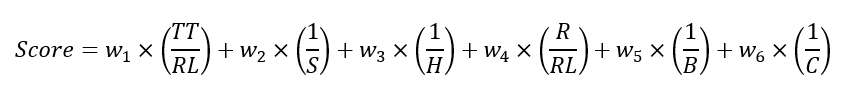

# Investigating Bus Stop Spacing in the Waterloo Region
Bus stop consolidation is a strategy used by urban planners and engineers to reduce total travel times and operating costs of bus routes by reducing the number of stops along a given route. This practice involves either removing stops or widening the distance between each stop. Bus stop consolidation continues to be a common optimization problem for transit agencies. On one hand, wider stop distances can decrease travel times and cut costs. On the other hand, shorter distances between stops improve access to amenities and reduce walking distances to and from stops, creating a design trade-off (Stewart & El-Geneidy, 2016). While numbers vary, a commonly cited reference is that North American bus stop spacings are averaged at 160-230m meters, whereas in Europe, bus stop spacings are wider, averaging 400-540 meters (Reilly, 1997).  Since bus stops in North America are consistently narrower than their European counterparts, closer spacings can lead to time inefficiencies and can incur more costs. As a result, several transit agencies across North America have recently considered bus stop consolidation research and projects (Higashide & Accuardi, 2016).

For example, a TransLink bus stop consolidation study indicated that two thirds of stops in Vancouver are too narrow considering that buses spend around one-sixth of their time idling at their respective stops. This accumulates to 700,000 hours of run time wasted per year and $73 million in operating costs (TransLink, n.d.). The primary findings from a survey conducted by TransitCenter and Resource System Group based in America include that riders value fast travel time over any potential benefits offered by a transit service (Higashide & Accuardi, 2016, pp. 6-8). Another study found that bus stop consolidation in Portland, Oregon improved bus running times by 6% (El-Geneidy, Strathman, Kimpel, & Crout, 2006). 

While methods to establish bus stop spacing vary across transit agencies, most agencies in the United States of America and Canada typically follow guidelines like installing one stop every few blocks (Walker, 2012). Research on developing more comprehensive methods to determine optimal bus stop spacing for transit agencies is relatively recent and can be broadly categorized into two approaches. The first involves complex mathematical models which are often challenging to replicate in civic firms. Examples include optimization algorithms based on Voronoi diagrams (Wang, Ye, Zhu, & Gu, 2022), an artificial intelligence-based model in Jordan (Shatnawi, Al-Omari, & Al-Qudah, 2020), and bus stop optimization simulation experiments in Wuhan (Liu, Li, & Ni, 2016). The second, less-studied category in the literature involves more comprehensive bus stop consolidation methodologies which incorporate region-specific survey data, GIS software, and assessments of rider impact. An example of such a holistic method was proposed by Stewart & El-Geneidy (2016). However, the methodology in the article involves catchment area formulas that are challenging to reproduce in different regions, as they are specifically tailored to survey data in Montreal. A study on bus stop consolidation practices in civic firms noted that planners in the United States usually prefer to use internal data over technical models, such as analyses using a combination of Automatic Passenger Counting (APC) and Automatic Vehicle Location (AVL) systems for measuring ridership. In this study, stops with low ridership were consolidated based on internal criteria and decisions used a lot of community engagement and political input. It was also found that transit agencies in the United States primarily consolidated stops to improve average bus speeds and on-time performance (Berez, 2015).

## Grand River Transit
Grand River Transit, the transit service operator for the Regional Municipality of Waterloo in Ontario, Canada, operates over 50 routes with more than 250 stops and 560 bus shelters across the tri-city area of Kitchener, Waterloo, and Cambridge. The agency does not yet have a public standardized procedure for bus stop consolidation but has mentioned undertaking a few consolidation projects in the agency’s 2017-2021 Business Plan. The business plan mentions bus stop consolidation as one of the agency’s “Transit Priority Measures” since it was mentioned that consolidation projects can “improve travel time and service reliability” and “[require] minimal physical, operational or enforcement changes” (GRT, 2018).

## GTFS
As a result of collaborative efforts led by Google and Bibiana McHugh at TriMet, Portland's transit agency, in 2005, the General Transit Feed Specification (GTFS) was established as a standardized, open-source data format for public transportation schedules. Formatted as comma-delimited data in a collection of zipped text files, GTFS allows transit operators, IT workers and developers alike to generate and share data about routes, stops, fares, schedules, and geographic information. The following figure displays a visual representation of the relationships between all GTFS files. Each blue box indicates a CSV or text file containing fields of data. For instance, “stops.txt” includes the stop ID, stop name, and parent station included in its file (Wu, et al., 2023). 

<strong>Relationships within a GTFS file (Wu, et al., 2023)</strong>

Common uses of the GTFS data specification include trip planners or mapping services that use the data to display transit information like services, delays, and schedules (McHugh, 2013). GTFS is mainly used across North America, Australia, and some countries in Western Europe where formal, developed transit agencies are commonly located (Goldstein & Dyson, 2013).

I'm proposing a freely available, replicable, and efficient methodology for determining which bus routes should be consolidated and how! This method will be applied to Grand River Transit in the Region of Waterloo, by leveraging the newly released "gtfs-segments" Python package. The method is as follows:

## Bus Stop Consolidation Software

For small to mid-sized transit agencies, transit agencies with a limited number of software/IT personnel available to replicate and run technical algorithms, or agencies that lack APC/AVL data, GTFS tools provide an efficient and reproducible means for making decisions regarding bus stop consolidation. There is also a clear push towards bus stop consolidation in North America, coupled with a lack of a reproducible, openly accessible procedure to implement these projects (Stewart & El-Geneidy, 2016). The purpose of this report is to propose a freely available, replicable, and efficient methodology for determining which bus routes should be consolidated and how. This method aims to be applicable to any transit agency with GTFS data around the world. The report also includes a case study of this method to Grand River Transit in the Region of Waterloo, by leveraging the newly released "gtfs-segments" Python package. This report focuses exclusively on transit routes in the Waterloo Region. All the analyses, procedures, and standards in this report are based on information from previous papers and articles about bus stop consolidation up to December 2023. The data and code used in the report uses version 2.0 of the GTFS specification. All software used is free-of-charge and the code is run on the Windows 11 operating system. The analyses conducted in this report are limited to the knowledge and experience of the author.

## Methodology
The proposed bus stop consolidation methodology optimizes for replicability and is broken down into a three-step framework, illustrated in the figure below. First, openly available GTFS data from GRT is cleaned and validated. Then, a statistical analysis is conducted on the data to determine if bus stop spacing is feasible in the Region of Waterloo. Next, an equation generates scores for each route based on route-level data provided by the "gtfs-segments" package. Finally, the shortest segments on the highest scored route will be visualized using the same package to compare which specific stops should be removed or widened.

### Assumptions and Constraints
It is assumed that the latest version of Python, pip, and Jupyter Notebook are installed before conducting this analysis. To install “gtfs-segments”, the transit agency must use the following command in their computer’s Terminal or Command Prompt (Devunuri & Lehe, 2023):

`$ pip install gtfs-segments`

Additionally, it is important to assume that this methodology is purely a preliminary analysis that is intended to be used before or in conjunction with stakeholder or policy input as well as zoning laws that may influence the placement and spacing of bus stops.  Because of time limitations and a lack of survey data, it was difficult to assess the direct effects of bus stop consolidation decisions produced in this report on ridership or public opinions that could shape outcomes of this methodology. Finally, the accuracy of this analysis is limited by the quality of the GTFS data provided by GRT in December 2023.

## Downloading and Cleaning the Data
The latest GTFS static data for Grand River Transit (GRT) was downloaded from the GRT website on December 23, 2023, as a compressed ZIP file. This file, containing eight text files with a size of 5.87 MB, was published by GRT on December 17, 2023 (Grand River Transit, 2023). The first step of the proposed method is to clean and he GTFS data. A few tools can be used to validate the data and ensure there were no duplicate fields or missing data. First, the Canonical GTFS Validator from MobilityData was used. The MobilityData GTFS Validator can input any GTFS feed in the form of a link and outputs warnings and errors based on the most recent version of the GTFS specification. After the GRT GTFS feed was run through the validator, no errors were outputted. A total of 61 warnings appeared, but it appears the feed was only missing optional fields such as “Agency ID” or optional columns like “timepoint” in “stop_times.txt”, which are not significant in this particular bus stop consolidation analysis (MobilityData, 2023). Next, the “gtfstidy” Python package can be used to further test the accuracy of the GTFS data provided from GRT (Brosi, 2021). The following was inputted in the Command Line/Terminal:

`$ gtfstidy -v GRT_GTFS.zip`
`$ gtfstidy -SCRmTcdsOeD GRT_GTFS.zip`

The package outputted “No Errors” and thus performed no changes to the main files of the GRT GTFS feed (Brosi, 2021).

## Mathematical Representation

Bus stop spacing involves more than computing the straight-line or Haversine distance which involves measuring the distance between two points on the Earth's surface. This methodology uses a weighted approach that was first introduced in 2021 as traversal weighting (Pandey, Lehe, & Monzar, 2021). Terminology surrounding traversal weighting and bus stop consolidation was solidified by Devunuri et al. (2023). A traversal is the event in which a bus stops at stop A, travels to stop B, and stops at stop B. A more frequent bus indicates more traversals within a specified period. A segment encompasses both the distance between stops A and B and the stops themselves. Traversal weighting assigns a higher weight to the sections between stops that experience a higher frequency of bus traversals or service before the schedule repeats. 

For an illustrated example, consider a blue route and a red route in the figure below which was created by Pandey, Lehe & Monzar (2021). The red route has three stops and two segments spaced 200m apart and is traversed three times per day. The blue route’s segment is traversed once per day and is 400m in length.

<strong>Sample bus network (Pandey, Lehe, & Monzar, 2021)</strong>

Thus, the traversal-weighted mean (TWM) spacing is:

Thus, segments with more traversals are weighted higher (Pandey, Lehe, & Monzar, 2021). 
Traversal weighting has advantages over uniformly weighting each segment or weighting based on the number of routes passing through each segment. Traversal-weighting can substitute the lack of ridership impact data in this methodology by scoring segments that have more assumed service or ridership on each segment (Devunuri, Qiam, Lehe, Pandey, & Monzer, 2023).

Using the “gtfs-segments” package, a weighted histogram of traversal weighted spacings in Waterloo, Ontario as of December 2023:

A mean of 351m is indicated by a dotted line on the graph. Stop spacing in the Region of Waterloo follows a right-skewed distribution with the mode of the most segment spacings concentrated in the 200-300m range. A maximum spacing threshold of 800 meters was established to eliminate potential outliers in the dataset that might skew the mean values. Also, only 9.3% of segments have spacing more than 800m as shown. Therefore, these segments were considered insignificant. Consequently, truncated mean and median values were determined. It is important to note that spacings were assumed to be calculated for trips that occur on the busiest day of the schedule for each route in the GTFS feed (Devunuri, Qiam, Lehe, Pandey, & Monzer, 2023). 

| Traversal Weighted Mean                  | 351m   |
|------------------------------------------|--------|
| Traversal Weighted Standard Deviation    | 154 m  |
| Traversal Weighted 25% Quantile          | 234 m  |
| Traversal Weighted 50% Quantile (Median) | 317 m  |
| Traversal Weighted 75% Quantile          | 436 m  |
| Number of Segments                       | 2540   |
| Number of Traversals                     | 115302 |
| Max Spacing                              | 800 m  |
| Segments w/ spacing 800m                 | 9.3%   |

Based on the values from the table above, there are a few reasons why the Waterloo Region may choose to consider bus stop consolidation. Firstly, the standard deviation of 153m indicates a considerable range of distances between bus stops and the transit agency might use this as an indicator to achieve more consistent spacing. Additionally, the mean of around 351m and the median of around 317m is lower than spacings in Europe which can range between 400-540m (Reilly, 1997). Since the mean and standard deviation may be influenced by outliers in the skewed distribution shown in the histogram, the interquartile range (IQR) can be used instead because it focuses on the central portion of the data (Hayter, 2012). The IQR can be evaluated by IQR = Q3 - Q1 and evaluates to 202m , indicating a wide variability in stop spacings in the Region. 

Along with the statistics outputted from the “gtfs-segments” package, census data can be used to make informed decisions about consolidation. For instance, according to Statistics Canada, 86.2% of the population in the Kitchener-Cambridge-Waterloo area lives less than 500m from a public transit access point in 2020 (Statistics Canada, 2020). The Waterloo Region can use this statistic to deduce that bus stop consolidation is feasible as the area has a large percentage of the population already within proximity to transit. Therefore, the Region can potentially reduce the number of stops without significantly affecting the overall coverage.

The next step in the methodology is to understand which routes are optimal for consolidation. The unique nature of “gtfs-segments” involves splitting a transit agency’s routes into segments. This allows for an output several variables which can be sorted, weighted, and scored to figure out which route to prioritize. The variables in this outputted data include:

-	RL: the route length [km];
-	TT: the total travel time for the entire route [hr];
-	H: the average headway between consecutive buses [hr];
-	S: the average bus speed along the route [km/h];
-	R: the average number of buses running concurrently [-];
-	B: the average spacing between concurrent buses [km]; and
-	C: the average distance between consecutive stops [km].

These variables can be combined to generate a formula that ranks routes based on their need for consolidation. There were several considerations when generating weights and a formula for this analysis. First, routes with a low average distance between consecutive stops should be consolidated. Next, routes with a longer total time relative to route length and a lower average speed could be more suitable for stop consolidation as they could benefit from decreasing total time and increasing average speed (Berez, 2015). Similarly, it would make sense to perform stop consolidation on routes with shorter headways since bus stop consolidation can enhance bus efficiency by reducing the cost needed to run several buses on a route without sacrificing service reliability. With the same logic, routes with a higher number of concurrently running buses relative to the route length should be consolidated. Finally, routes with a higher average number of concurrently running buses should also undergo stop consolidation as this could also be a cost-effective method to reduce the number of buses required on a given route. 

Note that the 301 ION Light Rail route is excluded because the scope of this analysis only includes bus routes. Route 302 which functions as a temporary ION bus until the completion of Stage 2 construction of the ION LRT route is excluded from this analysis as its stops are based potential ION stop placements. Similarly, a few special high school service buses, specifically Routes 9801 and 9851, are excluded from this scoring analysis as their schedules are only related to high school commuting times.

Based on these considerations, an equation was developed that assigns a higher score based on a route’s propensity to bus consolidation:

In this equation, weights w_1-w_6 were normalized so that they all added up to 1. This equation can change to accommodate various priorities required by different transit agencies. Based on current research, it was decided that w_1 and w_2 were to be given higher weights—0.4 and 0.2, respectively —as these prioritize total time and bus speed which was preferred by passengers in a bus consolidation survey conducted by TransitCenter (Higashide & Accuardi, 2016). The remaining weights were assigned an equal weight of 0.1. Using the “gtfs-segments” package, all route data was exported in a tabular format in an Excel sheet. Using Excel, separate scores were computed using the equation above for each direction of each route. The values from both directions were averaged to produce one score for each route. It was ultimately determined that the routes with the highest scores, or those that should be prioritized for consolidation, were Route 7, followed by Route 8, and then Route 9, with average scores of 0.78, 0.72, and 0.69, respectively.

It is important to comment on the quality and reliability of these findings. The decision to choose these three routes for consolidation excludes political decisions, public opinion, and zoning laws that could change the results. Further, the results outputted from Equation 5 are limited by the quality of the GTFS data the transit agency produced including any errors in schedules or shapes of routes could directly impact final scores.

Route 7, as the highest scoring route, was analyzed first. As shown in the figure below, Route 7 travels between Conestoga Station to Fairway Station. The route has 10 main stops and several intermediate stops (GRT, 2023). According to the “gtfs-segments” data, Route 7 has a length averaging 13.82km and the total travel-time end-to-end is 40 minutes. Buses arrive every 15 minutes at a given stop and the average speed of the buses on the route is 20.63km/h. The route has the 3rd highest number of concurrently running buses out of all routes and the spacing between them only averaging 4.7km. The spacing between stops on Route 7 averages a mere 320m, which is close to the median distance between stops in Waterloo Region.

<strong>A schematic of GRT's Route 7 (GRT, 2023)</strong>

## Prioritizing in Stops to Consolidate
The next step in the methodology is to determine the shortest bus spacing length on the most prioritized route for consolidation, which in this case is Route 7. Using “gtfs-segments”, a table of the lengths of each segment for each route was displayed in a tabular format. It was determined that the shortest segment on Route 7 was between stop 1182 (King/Ottawa) and stop 1183 (King/Borden) with a stop spacing of only 131.74 m. Using “gtfs-segments”, this segment was visualized on a route-level view and on a segment-level view in the figures below:

<strong>Route level view of segment between stop 1882 and stop 1883</strong>

<strong>Segment level view between stop 1882 and stop 1883</strong>

Upon closer examination, there seems to be no major reason why the stops are so close together. Both stops are close to similar intersections within walking distance of the same amenities (e.g., a Tim Horton’s location, a bank, and a climbing gym) as. Further, both stops are only used by Route 7 as of December 2023. 

<strong>Stop 1882 (left) and stop 1883 (right)</strong>

Similarly, both stops serve as close connections to the ION LRT Borden station as seen in Google Maps screenshot below, but since stop 1882 (King/Ottawa) is further from the ION light rail train connection than stop 1883 (King/Borden) as shown in the figure below, removing this stop could make more sense to improve land use and increase bus speeds assuming the bus stops at each stop. 

<strong>Proximity of stops 1882 and 1883 to Borden Station (Google Maps, 2023)</strong>

This stop removal can also reduce bus idling time at the stop which is about an average of 20s per stop according to a study at George Mason University (Shrestha & Zolnik, 2022). Each removed stop can also save costs of around $1000/year on maintenance based on bus stop costs in Mississauga, Ontario (City of Mississauga, 2023). A commonly used rule in academia sets the maximum comfortable walking distance between bus stops and commonly accessed amenities at 400 meters (El-Geneidy, Tétreault, & Surprenant-Legault, 2009). Using the Google Maps distance tool, the distances from Tim Hortons, Grand River Rocks, City Café Bakery and Borden Station to both stops are less than 400 metres (Google Maps, 2023). Ultimately, it is recommended that Waterloo Region prioritize the consolidation of Route 7 and, more specifically, remove the stop at King/Ottawa.

## Conclusions
In summary, this report proposed a three-step method to perform bus stop consolidation using freely available GTFS data and software packages like "gtfs-segments". The report focused on applying the method to Grand River Transit in the Waterloo Region, a transit agency without a public bus stop consolidation process. In the proposed methodology, a statistical analysis revealed that Waterloo Region was suited towards bus stop widening, especially considering GRT’s wide variability of observed spacings and a traversal-weighted median of only around 312m, which is lower than European counterparts. Then, a scoring system ranked Route 7 as the route with the highest potential for consolidation in the Region of Waterloo. Finally, a segment visualization of the shortest spacing in Route 7 revealed that the removal of the King/Ottawa stop could be prioritized to improve land use, increase bus speeds, reduce maintenance costs and idling time. 
A decision matrix showed the trade-offs between reproducibility, accuracy, time spent, and ease-of-use between different methods for bus stop consolidation in academia and in practice. The matrix revealed that while the proposed method is easy to use, is replicable, and takes less time than other methods, it can lack accuracy due to lack of community or policy data involved in the scoring system. Therefore, a few recommendations are proposed for future research. First, the scoring system could be refined by incorporating additional factors such as land-use characteristics, passenger demographics, and environmental impact to improve the method’s accuracy. Second, it would be helpful apply this method to different transit agencies in other continents to assess its reproducibility. In a global landscape where transit agencies grapple with resource and staffing constraints, the increasing use and prevalence of transit data formats like GTFS can help make informed decisions about bus stop spacing.

## References
Berez, D. (2015). The Bus Stops Here: Best Practices in Bus Stop Consolidation and Optimization. UCLA: Institute of Transportation Studies. Retrieved from https://escholarship.org/uc/item/4dd8h1vs

Brosi, P. (2021). gtfstidy. Retrieved from GitHub: https://github.com/patrickbr/gtfstidy

Center for Urban Transportation Research. (n.d.). Awesome Transit: Community list of transit APIs, apps, datasets, research, and software. Retrieved from GitHub: https://github.com/CUTR-at-USF/awesome-transit

City of Mississauga. (2023). Transit advertising. Retrieved from MiWay: https://www.mississauga.ca/miway-transit/transit-advertising/

Devunuri, S., & Lehe, L. (2023). GTFS Segments. Retrieved from GTFS Segments: https://gtfs-segments.readthedocs.io/en/latest/

Devunuri, S., Qiam, S., Lehe, L. J., Pandey, A., & Monzer, D. (2023). Bus Stop Spacings Statistics: Theory and Evidence. ArXiv. doi:https://doi.org/10.48550/arXiv.2208.04394

El-Geneidy, A. M., Tétreault, P. R., & Surprenant-Legault, J. (2009). Pedestrian Access to Transit: Identifying Redundancies and Gaps Using a Variable Service Area Analysis.

El-Geneidy, A., Strathman, J. G., Kimpel, T. J., & Crout, D. T. (2006). Effects of Bus Stop Consolidation on Passenger Activity and Transit Operations. Transportation Research Record, 32-41. doi:https://doi.org/10.1177/0361198106197100104

Goldstein, B., & Dyson, L. (2013). Beyond Transparency: Open Data and the Future of Civic Innovation. Chicago: Code for America.

Grand River Transit. (2023). Open data. Retrieved from Grand River Transit: https://www.grt.ca/en/about-grt/open-data.aspx
GRT. (2023). PDF Schedules. Retrieved from Grand River Transit: https://www.grt.ca/en/schedules-maps/resources/Bus-schedules/PTT_RT_007_20231106-web-FIXED.pdf

Hayter, A. (2012). Probability and Statistics for Engineers and Scientists (4 ed.). Denver, United States of America: Brooks/Cole.
Higashide, S., & Accuardi, Z. (2016). Who’s On Board 2016. New York City: TransitCenter. Retrieved from https://transitcenter.org/wp-content/uploads/2016/07/TransitCenter-WOB-2016.pdf

McHugh, B. (2013). Pioneering Open Data Standards: The GTFS Story. In B. Goldstein, D. O'Neil, E. Coleman, B. McHugh, M. Flowers, & T. O'Reilly, Beyond Transparency. Code for America. Retrieved from https://beyondtransparency.org/part-2/pioneering-open-data-standards-the-gtfs-story/

MobilityData. (2023). Canonical GTFS Schedule Validator. Retrieved from MobilityData: https://gtfs-validator.mobilitydata.org/

Moovit. (n.d.). Transit Data Manager. Retrieved from Moovit: https://moovit.com/maas-solutions/transit-data-manager/

National RTAP. (n.d.). GTFS Builder. Retrieved from National Rural Transit Assistance Program: https://www.nationalrtap.org/Technology-Tools/GTFS-Builder

Pandey, A., Lehe, L., & Monzar, D. (2021). Distributions of Bus Stop Spacings in the United States. Transport Findings. doi:https://doi.org/10.32866/001c.27373

Reilly, J. (1997). Transit Service Design and Operation Practices in Western European Countries. Transportation Research Record: Journal of the 

Transportation Research Board, 1604(1). doi:https://doi.org/10.3141/1604-01

Shrestha, R. M., & Zolnik, E. J. (2022). Eliminating Bus Stops: Evaluating Changes in Operations, Emissions and Coverage. Journal of Public 
Transportation, 16(2), 153-175. doi:https://doi.org/10.5038/2375-0901.16.2.8

Statistics Canada. (2020). Proximity to Public Transportation in Canada's Metropolitan Cities, and related Commuting Data. Retrieved from 
Statistics Canada: https://www150.statcan.gc.ca/t1/tbl1/en/tv.action?pid=2310028601

Stewart, C., & El-Geneidy, A. (2016). Don’t stop just yet! A simple, effective, and socially responsible approach to bus-stop consolidation. 
Public Transport: Planning and Operations, 1-23. doi:10.1007/s12469-015-0112-9

TransLink. (n.d.). Bus Stop Balancing. Retrieved from TransLink: https://www.translink.ca/plans-and-projects/projects/bus-projects/bus-stop-balancing

Trillium Transit. (n.d.). GTFS Manager. Retrieved from Trillium: https://trilliumtransit.com/gtfs/gtfs-manager/

Walker, J. (2012). Human Transit: How Clearer Thinking about Public Transit Can Enrich Our Communities and Our Lives. Island Press.

Wu, J., Du, B., Gong, Z., Wu, Q., Shen, J., Zhou, L., & Cai, C. (2023, March). A GTFS data acquisition and processing framework and its application to train delay prediction. International Journal of Transportation Science and Technology, 12(1), 201-216. doi:https://doi.org/10.1016/j.ijtst.2022.01.005

