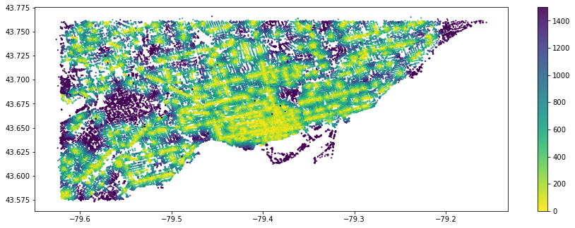
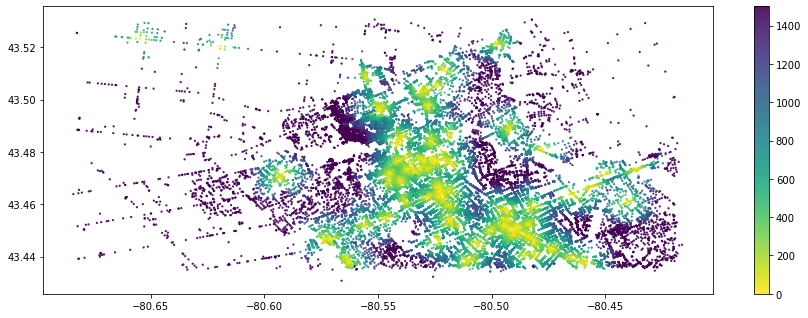

# Exploring Accessibility in the Waterloo Region

I recently came across [UrbanAccess](https://github.com/UDST/urbanaccess) on GitHub and I thought it was magic. Since then I've gained a bit more of how to read and write code, but I still think the fact that we can visualize complex urban forms into simple visualizations is still very magical and powerful to me. There was no other option than to explore it. 

UrbanAccess is a tool that gathers data from [Open Street Map (OSM)](https://www.openstreetmap.org/#map=2/63.3/-109.3) and uses a network tool called [Pandana](http://udst.github.io/pandana/) which measures accessibility and shortest distances to graph street notes and routes. These tools ultimately help measure accessibility in a given city or area. Using just a few lines of Python code, this free, open-source tool can be used by the general public, urban planners, civil engineers, firms, municipalities, government, universities and more. 

Visualizing accessibility in a region can help municipalities understand where to allocate funding and/or expand pedestrian access to key amenities. In the context of this blog post, I'm going to define accessibility as the ability of a person to travel to a destination/amenity in the shortest time possible. 

In this post, I'm going to do some high-level analysis on accessibility of transit networks and bike paths in two cities: Waterloo  and Toronto in Canada. This is the culmination of a series of explorations using these tools for the first time, so it's pretty exciting!

---
Urbanaccess supports every city that Open Street Map gathers data in, so feel free to try out some analyses of your own in a city of your choice!. You can use the code I used by accessing this [repository]().

Contact me if you have any questions about this post or if you just want to nerd about this tool/transit with someone.

Time to explore!
---
The city boundaries in this project are loosely defined as in they do not encompass the exact legal boundaries of each city but are very close; I used [bbox finder](http://bboxfinder.com/#0.000000,0.000000,0.000000,0.000000) to get a rough perimeter of the area to analyze. 

Here, I primarily followed an UrbanAccess tutorial to make heat maps outlining accessibility to a certain amenity. In this case, I'm choosing restaurants because it's a common, prevalent and generally desirable amenity across most cities. The x-axis represents the latitude and the y-axis represents the longitude. The coloured bar on the right shows the distance in metres (m) from the restaurants.

Here's Toronto! Note the density. There's generally a lot of restaurants accessible within around 200m, especially near the downtown. What's interesting is that there's a specific purple patch without any restaurants. This could be because of lack of public data, so I'll have to dig further into that. 

Comparing that to Waterloo, we're seeing most of the restaurants being available from short distances in the Uptown Waterloo/university area. If we approach the bottom-right corner of the map, we see a large number of restaurants in Downtown Kitchener. Conversely, the more we diverge from the city centers, we observe less restaurants being accessible. There are whole suburbs and neighborhoods without immediate access to a food amenity. 

You might have a lot of questions. Don't worry, same! There's a lot to unpack here. For example: 
- What do the dots on the map represent?
- If it's accessible within 200m, I'm still unsure as to where the starting points of those measurements are from.

Over time, I hope to get some of these answers and update this post when that time comes. For now, I'm just happy my code ran and that I was able to learn so much about GTFS/OMSnx/Pandana/Open Street Map along the way. Hope you learned more about urban data visualization and/or got a newfound spark to create something of your own. 

Until next time (or on an updated version of this exploration post), 

Adriana