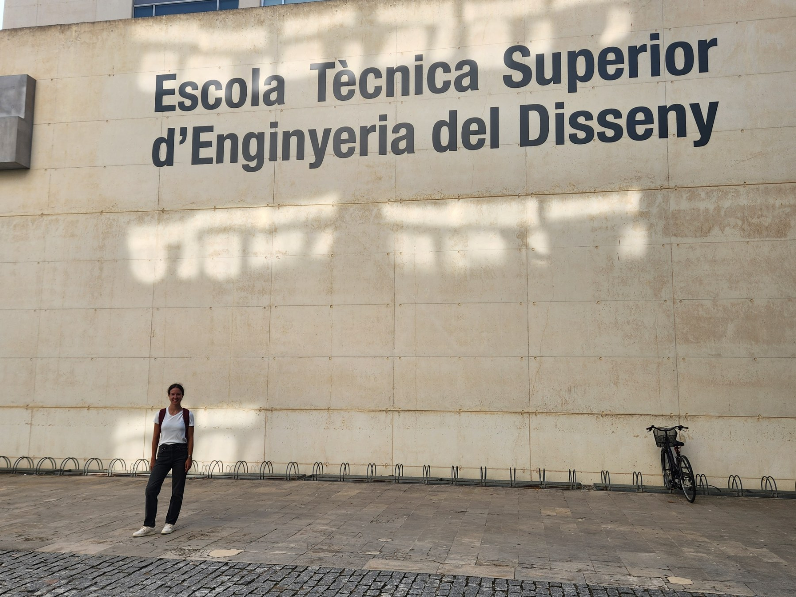

# Transit Data in Europe

## The City
Valencia has been on my bucket list for a while. Having already explored Barcelona and Andalucia in the past, it seemed as if Valencia was the third step in the Spanish trilogy (excluding a potential trek through the Camino de Santiago).

After long summer days of studying, exams, midterms and assignments, I packed my bags on August 20th and went to the third largest city in Spain. I find the best time to check exam grades is when you're 6000km away from home, it makes that school bubble seem smaller.

Valencia is characterized by a big port, paella and the Silk Exchange. Moorish and catholic architecture blend throughout the city. We took road trips to various cities and remote beaches along la Costa Blanca (which goes against transit enthusiast fashion, but to my defense the traffic infrastructure was very nice), discovered quaint towns around the Valencia province like Terual and got demolished by tomatoes at la Tomatina in Buñol (everyone needs to get tomatoed at least once in their lifetime). Our favourite destination by far was Altea. Around an hour and a bit away from the main city, It had the perfect pebbled beach imaginable and I think we went there a total of 5 days.

< 3

## The Workshop
It happened by pure circumstance that the [MobilityData](https://mobilitydata.org/) workshop and the OpenTripPlanner Open Days conferences would both be occuring while I was on family vacation. It was one of those coincidences that you can't really comprehend, but it seems Valencia was *the* destination that year for transit enthusiasts of all backgrounds and I just had to go. The workshop invited folks from industry, non-profits and students to discuss current transit data standardization practices. Sticky notes, markers and big voices in transit all gathered in classrooms at the [Valencia Polytechnic University (Universidad Politécnica de Valencia (UPV)](https://www.upv.es/en/). 

The university

At a GTFS workshop with some awesome people!

Attendees at lunch

Ideas!

More stickies

OpenTripPlanner!

There were a TON of insights and anecdotes I gathered from these two conferences and I'll try to distill a few of them here:
1. GTFS/GTFS-rt (see [my blog on GTFS](/posts/gtfs-101) to learn more) and NeTEx are two similar yet very seperate transit data standards in terms of complexity and use. NeTEx is not only used in Europe it's now being used in Australia. I kind of wish there were on global transit standard, but with a lot of handoff and international differences, it's become hard to truely *standardize* everything into one format.
2. There is a huge lack of exposure of transit data and transit technology in classrooms and to new learners. Most people don't understand what powers a search query on a trip planning app, and where that data is consumed, produced and transformed. Even more, this information isn't being taught in specialized urban planning or transportation engineering courses. Transit data as a concept is largely congregated through the work of organizations whether they be public or private. Further, the discussions, motions and decisions on CSV changes to GTFS are primarliy led by a few "power maintainers" in MobilityData repositories.
3. What constitutes quality data? Where can producers and consumers find examples
4. Global student ambassadors, transit data competitions/hackathons, and curriculums or YouTube channels are excellent ways to bring students into the transit data conversation
5. This one is an issue for me: OpenTripPlanner is very complex for new learners, especially those outside of organizations that actively use it (see a [setup tutorial](/posts/otp) I tried to put together). Despite that, OpenTripPlanner is very cool, is very well maintained and should be more widely used and known.
6. The best way to go about attending a workshop or conference is to listen more than speak. Also, get contact information.
7. The transit community is very well-connected, open, generally diverse and friendly. I definitley see myself in this industry for a longer time.

To more travels,

Adriana
